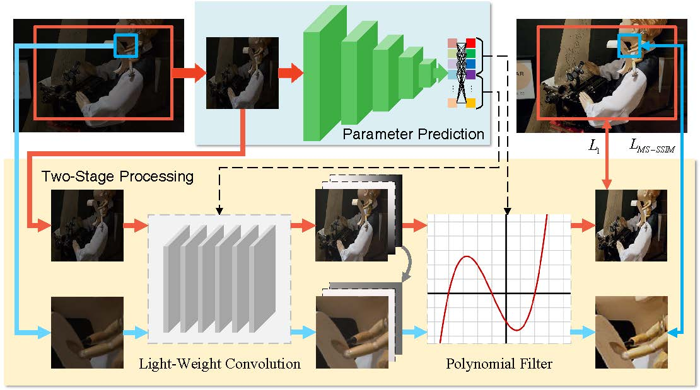

# Meta-Enhancer

Official implementation for the paper 'Meta-Enhancer: Model Parameter Learning for Real-Time High-Resolution Image Enhancement'. 



## Requirement

The recommended environment is as follows:

python 3.7.0, pytorch 1.3.1, numpy 1.15.1, scipy 1.1.0, opencv 3.4.1, scikit-image 0.14.0, pytorch_msssim 0.2.0

**Generally, other close versions of packages can also run our code.**

### Additional

lpips_pytorch:

```
pip install git+https://github.com/S-aiueo32/lpips-pytorch.git
```

jpeg4py:

```
apt-get install libturbojpeg
pip install jpeg4py
```

## Data

Download the [train set](https://drive.google.com/file/d/1D0NvBNrzx_0HpjMR8Dh4nKYI_zuS-x4B/view?usp=sharing), [test set](https://drive.google.com/file/d/1--iSszM__KO9Mg4Ag4w_o64h_eUq_E9S/view?usp=sharing), and [pre-trained model](https://drive.google.com/file/d/1eubNFb3nyiVayLevQCI3pSm7ukUJO3xf/view?usp=sharing).

Extract the files to `data` folder and `save_model` folder as follow:

```
~/
  data/
    train/
      high/
        ... (scene id)
      low/
        ... (scene id)
      thumb_high/
        ... (scene id)
      thumb_low/
        ... (scene id)
    test/
      high/
        ... (jpg files)
      low/
        ... (jpg files)
  save_model/
    best_model.pth.tar
```

## Quick Start

### Train

Train the model:

```
python train.py
```

### Test

Test the trained model:

```
python test.py
```

*Note that image loading, decoding and evaluating comsumes a lot of time.*